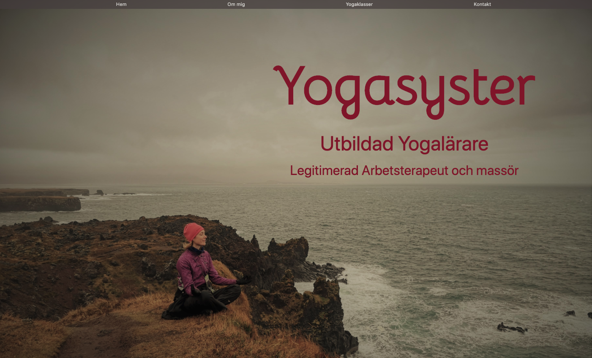

# yogasyster

Yogasyster is a homepage for a customer that is newly educated as a yoga teacher. The customer had specifications on what links to have in the navbar, what pictures to use and that it should be earthy colors with some red hints. When I started to make the site I realized that I needed som sketches for layout which I also added.

The project started as a "hackday" at School of applied technology. I am still adding features and style to it. The site will be ready to deploy in june 2020.

## 👨‍💻 Search engine optimaztion (SEO)

Great SEO is important to increase high quality traffic on the site. It is in both the web page owner and the user interest that the right user finds the right web page, and that the page will reach the right user.

Since the site is for a startup I put some work in to get a high SEO. I put some extra energy on:

- well written description, title and alt tags
- responsiveness
- HTML semantics
- nameing convention on pictures

## 🗄️ Tech stack

The site has frontend and a backend. For the backend I have used Nodemailer to send emails direct to a existing (fake)mail. When the page launch I will change the email and where to store sensitive data.

- React (Functional and class components, Hooks, Routes)
- Styled Components
- Flexbox
- Express
- Node.js
- Nodemailer (a module for Node.js applications to allow email sending)

## 🧪 Testing

Clone the project.

- Go to client "npm start"
- Go to routes "npm start"
